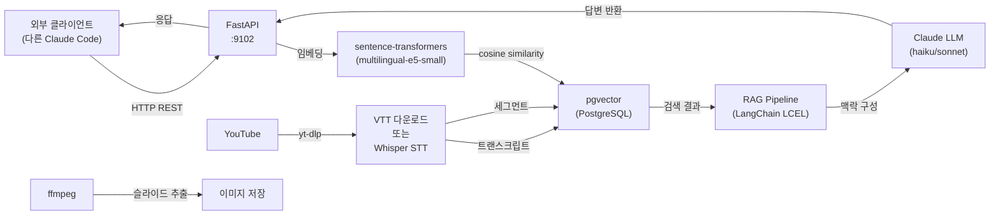

# Offline Thinking API Reference

다른 프로젝트나 Claude Code 세션에서 이 서비스의 데이터와 분석 기능을 활용할 때 참조하는 문서입니다.

**Base URL**: `http://localhost:9102`

**인증**: 현재 미인증 (향후 JWT 토큰 기반 인증 추가 예정)

---

## 빠른 시작 (Quick Start)

다른 Claude Code 세션에서 이 서비스를 사용할 때 복사-붙여넣기 할 수 있는 기본 패턴:

### 1. 특정 채널에서 키워드 검색

```bash
curl -s "http://localhost:9102/api/search?q=langchain&mode=semantic&top_k=5&channel=조코딩" | jq .
```

**응답**:
```json
{
  "query": "langchain",
  "mode": "semantic",
  "count": 5,
  "results": [
    {
      "video_id": "dQw4w9WgXcQ",
      "title": "LangChain 튜토리얼 - 완벽 가이드",
      "channel": "조코딩",
      "score": 0.87,
      "snippet": "LangChain은 대규모 언어 모델을 활용한 애플리케이션..."
    }
  ]
}
```

### 2. 특정 영상에 질문하기

```bash
curl -X POST "http://localhost:9102/api/qa/dQw4w9WgXcQ" \
  -H "Content-Type: application/json" \
  -d '{"question": "이 영상에서 설명한 핵심은?", "language": "ko"}' | jq .
```

**응답**:
```json
{
  "answer": "LangChain은 LLM 애플리케이션 개발을 위한...",
  "quota_remaining": 9,
  "quota_type": "free",
  "video_id": "dQw4w9WgXcQ"
}
```

### 3. 여러 영상 기반 RAG 질문

```bash
curl -X POST "http://localhost:9102/api/rag/ask" \
  -H "Content-Type: application/json" \
  -d '{
    "question": "벡터 DB와 임베딩의 관계는?",
    "channel": "조코딩",
    "top_k": 5
  }' | jq .
```

**응답**:
```json
{
  "question": "벡터 DB와 임베딩의 관계는?",
  "answer": "벡터 DB는 임베딩된 벡터를 저장하고...",
  "video_ids": ["vid1", "vid2", "vid3"],
  "sources": [
    {
      "video_id": "vid1",
      "title": "벡터 데이터베이스 101",
      "channel": "조코딩",
      "score": 0.92
    }
  ]
}
```

### 4. 플레이리스트 생성 및 영상 추가

```bash
# 플레이리스트 생성
curl -X POST "http://localhost:9102/api/playlists" \
  -H "Content-Type: application/json" \
  -d '{"title": "AI/ML 기초", "description": "초급자용", "channel": "조코딩"}' | jq .

# 응답 (playlist_id 획득)
# {"id": "abc-123", "title": "AI/ML 기초", ...}

# 플레이리스트에 영상 추가
curl -X POST "http://localhost:9102/api/playlists/abc-123/videos" \
  -H "Content-Type: application/json" \
  -d '{"video_ids": ["vid1", "vid2", "vid3"]}' | jq .
```

---

## 엔드포인트 레퍼런스

### 의미론적 검색 (pgvector)

#### GET /api/search

pgvector와 sentence-transformers를 이용한 의미론적 검색. cosine 유사도로 유사 영상 스크립트 찾기.

**파라미터**:

| 파라미터 | 타입 | 필수 | 설명 |
|----------|------|------|------|
| q | string | O | 검색 쿼리 |
| mode | string | X | "semantic" (기본) 또는 "keyword" |
| top_k | integer | X | 결과 개수 (기본 10) |
| channel | string | X | 채널 필터 (예: "조코딩") |
| playlist_id | string | X | 플레이리스트 필터 |

**요청 예시**:
```bash
curl "http://localhost:9102/api/search?q=transformer&mode=semantic&top_k=3&channel=조코딩"
```

**응답 (200)**:
```json
{
  "query": "transformer",
  "mode": "semantic",
  "count": 3,
  "results": [
    {
      "video_id": "abc123",
      "title": "Transformer 아키텍처 완벽 분석",
      "channel": "조코딩",
      "score": 0.95,
      "snippet": "Attention is All You Need 논문에서 제안된 Transformer..."
    }
  ]
}
```

**응답 (400)**:
```json
{"detail": "q (search query) is required"}
```

---

### RAG 기반 Q&A

#### POST /api/rag/ask

의미론적 검색으로 관련 영상을 찾은 후 LLM이 종합 답변 생성.

**요청 본문**:
```json
{
  "question": "사용자 질문",
  "channel": "채널 필터 (옵션)",
  "playlist_id": "플레이리스트 ID (옵션)",
  "top_k": 5
}
```

**요청 예시**:
```bash
curl -X POST "http://localhost:9102/api/rag/ask" \
  -H "Content-Type: application/json" \
  -d '{
    "question": "어떻게 하면 좋은 프롬프트를 만들 수 있을까?",
    "channel": "조코딩",
    "top_k": 5
  }'
```

**응답 (200)**:
```json
{
  "question": "어떻게 하면 좋은 프롬프트를 만들 수 있을까?",
  "answer": "좋은 프롬프트의 핵심 원칙은 다음과 같습니다:\n\n1. 명확성...",
  "video_ids": ["vid1", "vid2", "vid3", "vid4"],
  "sources": [
    {
      "video_id": "vid1",
      "title": "Prompt Engineering 101",
      "channel": "조코딩",
      "score": 0.88
    }
  ]
}
```

**응답 (관련 영상 없음, 200)**:
```json
{
  "question": "어떤 희귀한 질문",
  "answer": "관련 영상을 찾을 수 없습니다.",
  "video_ids": [],
  "sources": []
}
```

---

### LangGraph 에이전트 (SSE 스트리밍)

#### POST /api/agent/ask

멀티스텝 에이전트 워크플로우 실행 (Server-Sent Events로 진행 상황 스트리밍).

**요청 본문**:
```json
{
  "question": "사용자 질문",
  "channel": "채널 필터 (옵션)"
}
```

**요청 예시**:
```bash
curl -X POST "http://localhost:9102/api/agent/ask" \
  -H "Content-Type: application/json" \
  -d '{"question": "AI와 ML의 차이를 설명해줄 수 있는 영상이 있나?", "channel": "조코딩"}' \
  -N
```

**응답 (SSE 스트림, 200)**:
```
data: {"status":"searching","message":"영상 검색 중..."}

data: {"status":"generating","message":"답변 생성 중..."}

data: {"status":"complete","result":{"answer":"...","sources":[...]}}
```

---

### 단일 영상 Q&A (쿼터 제한)

#### POST /api/qa/{video_id}

특정 영상의 트랜스크립트를 컨텍스트로 LLM이 답변.
**무료**: 일 10회 (마지막 리셋 시점 기준) / **유료**: 무제한

**요청 본문**:
```json
{
  "question": "사용자 질문",
  "language": "ko"
}
```

**요청 예시**:
```bash
curl -X POST "http://localhost:9102/api/qa/dQw4w9WgXcQ" \
  -H "Content-Type: application/json" \
  -d '{"question": "이 영상의 주제는?", "language": "ko"}'
```

**응답 (200)**:
```json
{
  "answer": "이 영상은 LangChain을 이용한 챗봇 구축 방법을 다룹니다...",
  "quota_remaining": 9,
  "quota_type": "free",
  "video_id": "dQw4w9WgXcQ"
}
```

**응답 (쿼터 초과, 429)**:
```json
{
  "error": "quota_exceeded",
  "message": "일일 무료 제한(10회) 초과. 유료 업그레이드가 필요합니다.",
  "quota_remaining": 0
}
```

**응답 (영상 없음, 404)**:
```json
{"detail": "video not found: unknown_id"}
```

---

#### GET /api/qa/{video_id}/history

특정 영상에 대한 Q&A 히스토리 조회.

**파라미터**:

| 파라미터 | 타입 | 필수 | 설명 |
|----------|------|------|------|
| user_id | string | X | 사용자 ID (미지정 시 요청자 ID) |
| limit | integer | X | 결과 개수 (기본 20, 최대 100) |

**요청 예시**:
```bash
curl "http://localhost:9102/api/qa/dQw4w9WgXcQ/history?limit=10"
```

**응답 (200)**:
```json
{
  "video_id": "dQw4w9WgXcQ",
  "user_id": "user123",
  "history": [
    {
      "id": 1,
      "question": "이 영상의 주제는?",
      "answer": "LangChain을 이용한...",
      "model": "claude-haiku-4-5-20251001",
      "created_at": "2026-05-24T10:30:00"
    }
  ]
}
```

---

#### GET /api/quota/status

현재 사용자의 쿼터 상태 조회.

**요청 예시**:
```bash
curl "http://localhost:9102/api/quota/status"
```

**응답 (200, 무료 사용자)**:
```json
{
  "user_id": "user123",
  "quota_type": "free",
  "daily_used": 3,
  "daily_limit": 10,
  "quota_remaining": 7,
  "total_used": 45
}
```

**응답 (200, 프리미엄 사용자)**:
```json
{
  "user_id": "user456",
  "quota_type": "premium",
  "daily_used": 50,
  "daily_limit": -1,
  "quota_remaining": -1,
  "total_used": 2340
}
```

---

#### POST /api/quota/upgrade/{user_id}

사용자를 프리미엄 요금제로 업그레이드 (Stripe 웹훅 또는 관리자 호출용).

**요청 예시**:
```bash
curl -X POST "http://localhost:9102/api/quota/upgrade/user123"
```

**응답 (200)**:
```json
{
  "ok": true,
  "user_id": "user123",
  "quota_type": "premium"
}
```

---

### 다중 영상 Q&A (SSE 스트리밍)

#### POST /api/videos/ask-multi

여러 영상의 트랜스크립트를 합쳐서 LLM에 질문 (공통점, 차이점 분석 가능).

**요청 본문**:
```json
{
  "video_ids": ["vid1", "vid2", "vid3"],
  "question": "사용자 질문",
  "history": []
}
```

**요청 예시**:
```bash
curl -X POST "http://localhost:9102/api/videos/ask-multi" \
  -H "Content-Type: application/json" \
  -d '{
    "video_ids": ["vid1", "vid2"],
    "question": "이 두 영상에서 공통적으로 언급한 개념은?"
  }' \
  -N
```

**응답 (SSE 스트림, 200)**:
```
data: {"text":"두 영상 모두"}
data: {"text":" 벡터 임베딩과"}
data: {"text":" 벡터 데이터베이스에"}
...
data: {"done":true}
```

**응답 (트랜스크립트 없음, 200)**:
```
data: {"error":"트랜스크립트를 찾을 수 없습니다."}
```

---

### 플레이리스트 관리

#### GET /api/playlists

모든 플레이리스트 조회 (옵션: 채널 필터).

**파라미터**:

| 파라미터 | 타입 | 설명 |
|----------|------|------|
| channel | string | 채널 필터 (옵션) |

**요청 예시**:
```bash
curl "http://localhost:9102/api/playlists?channel=조코딩"
```

**응답 (200)**:
```json
[
  {
    "id": "abc-123",
    "title": "AI/ML 기초",
    "description": "초급자용",
    "channel": "조코딩",
    "source_url": "https://www.youtube.com/playlist?list=...",
    "thumbnail": "https://...",
    "item_count": 15,
    "youtube_playlist_id": "PLxxxxxx"
  }
]
```

---

#### POST /api/playlists

새로운 플레이리스트 생성.

**요청 본문**:
```json
{
  "title": "플레이리스트 제목",
  "description": "설명 (옵션)",
  "channel": "채널 이름"
}
```

**요청 예시**:
```bash
curl -X POST "http://localhost:9102/api/playlists" \
  -H "Content-Type: application/json" \
  -d '{"title": "Python 고급", "channel": "조코딩"}'
```

**응답 (200)**:
```json
{
  "id": "new-uuid",
  "title": "Python 고급",
  "description": ""
}
```

---

#### PUT /api/playlists/{playlist_id}

플레이리스트 메타데이터 수정.

**요청 본문**:
```json
{
  "title": "새 제목",
  "description": "새 설명"
}
```

**요청 예시**:
```bash
curl -X PUT "http://localhost:9102/api/playlists/abc-123" \
  -H "Content-Type: application/json" \
  -d '{"title": "Python 고급 (업데이트)"}'
```

**응답 (200)**:
```json
{"ok": true}
```

---

#### DELETE /api/playlists/{playlist_id}

플레이리스트 삭제 (포함된 영상은 유지).

**요청 예시**:
```bash
curl -X DELETE "http://localhost:9102/api/playlists/abc-123"
```

**응답 (200)**:
```json
{"ok": true}
```

---

#### GET /api/playlists/{playlist_id}/videos

플레이리스트 내 영상 목록.

**요청 예시**:
```bash
curl "http://localhost:9102/api/playlists/abc-123/videos"
```

**응답 (200)**:
```json
[
  {
    "id": "vid1",
    "title": "Python 기초 1",
    "thumbnail": "https://...",
    "position": 1
  }
]
```

---

#### POST /api/playlists/{playlist_id}/videos

플레이리스트에 영상 추가.

**요청 본문**:
```json
{
  "video_ids": ["vid1", "vid2", "vid3"]
}
```

**요청 예시**:
```bash
curl -X POST "http://localhost:9102/api/playlists/abc-123/videos" \
  -H "Content-Type: application/json" \
  -d '{"video_ids": ["vid1", "vid2"]}'
```

**응답 (200)**:
```json
{"ok": true}
```

---

#### DELETE /api/playlists/{playlist_id}/videos/{video_id}

플레이리스트에서 영상 제거.

**요청 예시**:
```bash
curl -X DELETE "http://localhost:9102/api/playlists/abc-123/videos/vid1"
```

**응답 (200)**:
```json
{"ok": true}
```

---

#### POST /api/playlists/import-youtube

YouTube 채널의 courses/playlists 탭에서 플레이리스트 자동 임포트 (2-pass).

**요청 본문**:
```json
{
  "url": "https://www.youtube.com/@channel/courses",
  "channel": "채널 이름",
  "cookie_profile": "/tmp/chrome-cdp-gdrive"
}
```

**요청 예시**:
```bash
curl -X POST "http://localhost:9102/api/playlists/import-youtube" \
  -H "Content-Type: application/json" \
  -d '{
    "url": "https://www.youtube.com/@조코딩/courses",
    "channel": "조코딩"
  }'
```

**응답 (200)**:
```json
{
  "ok": true,
  "playlists_created": 5,
  "playlists_updated": 2,
  "playlists_total": 7
}
```

---

### 영상 목록 및 메타데이터

#### GET /api/videos

DB에 저장된 영상 목록 (필터 옵션 지원).

**파라미터**:

| 파라미터 | 타입 | 설명 |
|----------|------|------|
| collection_id | string | 컬렉션 필터 |
| channel | string | 채널 필터 |
| search | string | 제목 검색 (ILIKE 와일드카드) |

**요청 예시**:
```bash
curl "http://localhost:9102/api/videos?channel=조코딩&search=transformer"
```

**응답 (200)**:
```json
[
  {
    "id": "abc123",
    "title": "Transformer 완벽 분석",
    "channel": "조코딩",
    "url": "https://youtu.be/abc123",
    "duration_sec": 1234,
    "text_length": 5678,
    "segment_count": 0,
    "language": "ko",
    "collection_id": "col_001",
    "thumbnail": "https://img.youtube.com/vi/abc123/mqdefault.jpg",
    "preview": "Transformer 아키텍처는...",
    "upload_date": "2026-05-20"
  }
]
```

---

#### GET /api/videos/summary

전체 영상 요약 통계 (채널별, 전체).

**요청 예시**:
```bash
curl "http://localhost:9102/api/videos/summary"
```

**응답 (200)**:
```json
{
  "total": 125,
  "channels": {
    "조코딩": {
      "count": 50,
      "totalDuration": 123456.0,
      "totalChars": 987654
    },
    "테드": {
      "count": 75,
      "totalDuration": 234567.0,
      "totalChars": 1234567
    }
  },
  "totalDuration": 357023.0,
  "totalChars": 2222221
}
```

---

#### GET /api/videos/{video_id}/transcript

특정 영상의 트랜스크립트와 세그먼트 조회.

**요청 예시**:
```bash
curl "http://localhost:9102/api/videos/abc123/transcript"
```

**응답 (200)**:
```json
{
  "fullText": "트랜스크립트 전문...",
  "correctedText": "교정된 트랜스크립트...",
  "segments": [
    {
      "time_str": "0:00",
      "start_sec": 0,
      "text": "안녕하세요"
    },
    {
      "time_str": "0:03",
      "start_sec": 3,
      "text": "오늘은 Transformer를..."
    }
  ]
}
```

---

### 영상 분석 제출 (STT + 슬라이드)

#### POST /api/transcribe/youtube

YouTube URL을 제출하여 비동기 STT/VTT 처리 시작.

**요청 본문**:
```json
{
  "url": "https://youtu.be/xyz123 또는 https://www.youtube.com/watch?v=xyz123",
  "language": "ko"
}
```

**요청 예시**:
```bash
curl -X POST "http://localhost:9102/api/transcribe/youtube" \
  -H "Content-Type: application/json" \
  -d '{"url": "https://youtu.be/dQw4w9WgXcQ", "language": "ko"}'
```

**응답 (202)**:
```json
{
  "task_id": "task-uuid-123"
}
```

**작업 진행 상황 조회** (별도 엔드포인트, 개별 문서 참고):
```bash
# task_id를 이용해 진행 상황 폴링
# /api/tasks/{task_id} (문서화 필요)
```

**작업 완료 후**:
```json
{
  "title": "LangChain 튜토리얼",
  "text": "전체 트랜스크립트...",
  "segments": 45,
  "ocr_frames": 12,
  "stt_source": "vtt_llm",
  "video_id": "dQw4w9WgXcQ",
  "slides": 15
}
```

---

#### POST /api/transcribe/file

로컬 오디오/영상 파일 업로드 및 STT 처리.

**파라미터 (multipart/form-data)**:

| 파라미터 | 타입 | 설명 |
|----------|------|------|
| file | file | 오디오/영상 파일 (.wav, .mp3, .mp4 등) |
| language | string | 언어 코드 (기본: "ko") |
| model | string | Whisper 모델 (기본: "mlx-community/whisper-large-v3-turbo") |

**요청 예시**:
```bash
curl -X POST "http://localhost:9102/api/transcribe/file" \
  -F "file=@/path/to/audio.wav" \
  -F "language=ko"
```

**응답 (202)**:
```json
{
  "task_id": "task-uuid-456"
}
```

---

### 컬렉션 (배치 처리)

#### POST /api/probe

URL을 분석하여 단건/다건 판별 및 영상 목록 반환 (하드 다운로드 없음).

**요청 본문**:
```json
{
  "url": "YouTube URL (단건, 플레이리스트, 채널)"
}
```

**요청 예시**:
```bash
curl -X POST "http://localhost:9102/api/probe" \
  -H "Content-Type: application/json" \
  -d '{"url": "https://www.youtube.com/@조코딩/videos"}'
```

**응답 (채널, 200)**:
```json
{
  "type": "channel",
  "url": "https://www.youtube.com/@조코딩/videos",
  "channel": "조코딩",
  "videos": [
    {
      "id": "vid1",
      "title": "Python 기초 1",
      "duration": 1234.5
    }
  ],
  "total": 150,
  "long_form_count": 145
}
```

---

#### POST /api/collections/create

컬렉션 생성 및 배치 VTT+LLM 처리 시작 (병렬 5개 실행).

**요청 본문**:
```json
{
  "url": "YouTube URL",
  "collection_name": "컬렉션 이름 (옵션)",
  "language": "ko",
  "min_duration": 300,
  "title_filter": "제목에 포함될 문자열 (옵션)"
}
```

**요청 예시**:
```bash
curl -X POST "http://localhost:9102/api/collections/create" \
  -H "Content-Type: application/json" \
  -d '{
    "url": "https://www.youtube.com/@조코딩/videos",
    "collection_name": "조코딩 AI 관련",
    "language": "ko",
    "min_duration": 600,
    "title_filter": "AI"
  }'
```

**응답 (202)**:
```json
{
  "task_id": "task-uuid-789"
}
```

---

#### GET /api/collections

저장된 모든 컬렉션 조회.

**요청 예시**:
```bash
curl "http://localhost:9102/api/collections"
```

**응답 (200)**:
```json
[
  {
    "id": "col_001",
    "type": "channel",
    "name": "조코딩 AI 관련",
    "source_url": "https://www.youtube.com/@조코딩/videos",
    "channel": "조코딩",
    "item_count": 50,
    "total_duration": 123456.0,
    "total_chars": 987654,
    "status": "done",
    "progress": 100,
    "created_at": "2026-05-24T10:00:00"
  }
]
```

---

## 데이터 구조

### Videos 테이블

```sql
CREATE TABLE stt_analysis.videos (
  id VARCHAR(255) PRIMARY KEY,          -- YouTube video ID
  title TEXT,                           -- 영상 제목
  source VARCHAR(50),                   -- 'youtube'
  channel VARCHAR(255),                 -- 채널 이름
  url TEXT,                             -- YouTube URL
  duration_sec INTEGER,                 -- 영상 길이 (초)
  text_length INTEGER,                  -- 트랜스크립트 문자수
  segment_count INTEGER,                -- 세그먼트 수
  language VARCHAR(10),                 -- 'ko', 'en' 등
  collection_id VARCHAR(255),           -- 소속 컬렉션 ID
  thumbnail VARCHAR(500),               -- 썸네일 URL
  preview TEXT,                         -- 미리보기 (처음 200자)
  upload_date DATE,                     -- 업로드 날짜
  created_at TIMESTAMP DEFAULT NOW()
);
```

### Transcripts 테이블

```sql
CREATE TABLE stt_analysis.transcripts (
  video_id VARCHAR(255) PRIMARY KEY,
  full_text TEXT,                       -- 원본 스크립트
  corrected_text TEXT,                  -- LLM 교정 스크립트
  stt_source VARCHAR(50),               -- 'vtt_llm', 'whisper', ...
  correction_model VARCHAR(100),        -- 'claude-haiku-4-5-20251001', ...
  segments JSONB,                       -- [{time_str, start_sec, text}, ...]
  embedding vector(384),                -- sentence-transformers 임베딩
  ocr_text TEXT,                        -- OCR 추출 텍스트
  ocr_frames_total INTEGER,             -- 분석한 프레임 총수
  ocr_frames_unique INTEGER,            -- 유니크 프레임 수
  created_at TIMESTAMP DEFAULT NOW(),
  updated_at TIMESTAMP DEFAULT NOW()
);
```

### User Quota 테이블

```sql
CREATE TABLE stt_analysis.user_quota (
  user_id VARCHAR(255) PRIMARY KEY,
  quota_type VARCHAR(50),               -- 'free', 'premium'
  daily_used INTEGER DEFAULT 0,         -- 오늘 사용 횟수
  daily_limit INTEGER,                  -- 일일 한도 (무료=10)
  last_reset_date DATE,                 -- 마지막 리셋 날짜
  total_used INTEGER DEFAULT 0,         -- 누적 사용 횟수
  created_at TIMESTAMP DEFAULT NOW(),
  updated_at TIMESTAMP DEFAULT NOW()
);
```

### QA History 테이블

```sql
CREATE TABLE stt_analysis.qa_history (
  id SERIAL PRIMARY KEY,
  user_id VARCHAR(255),
  video_id VARCHAR(255),
  question TEXT,
  answer TEXT,
  model VARCHAR(100),
  created_at TIMESTAMP DEFAULT NOW()
);
```

### Playlists 테이블

```sql
CREATE TABLE stt_analysis.playlists (
  id VARCHAR(255) PRIMARY KEY,
  title VARCHAR(255),
  description TEXT,
  channel VARCHAR(255),
  source_url TEXT,
  thumbnail VARCHAR(500),
  item_count INTEGER DEFAULT 0,
  youtube_playlist_id VARCHAR(255),     -- YouTube 원본 ID (있는 경우)
  created_at TIMESTAMP DEFAULT NOW(),
  updated_at TIMESTAMP DEFAULT NOW()
);
```

---

## 아키텍처



---

## 운영 정보

### 서버 시작

```bash
# 백엔드 서버 시작 (포트 9102)
cd /Users/ez2sarang/Documents/dev/ai/offline-thinking/api
python -m uvicorn main:app --host 0.0.0.0 --port 9102 --reload
```

**환경변수** (`.env` 파일):
```
ANTHROPIC_API_KEY=sk-...
POSTGRES_HOST=localhost
POSTGRES_PORT=5432
POSTGRES_USER=stt_user
POSTGRES_PASSWORD=...
POSTGRES_DB=stt_analysis
EMBED_MODEL=intfloat/multilingual-e5-small
API_BASE_URL=http://localhost:9102
```

### 임베딩 배치 빌드

현재 임베딩은 첫 질문 시 on-demand로 생성됩니다.
전체 트랜스크립트를 미리 임베딩하려면 별도 배치 스크립트 실행 필요 (문서화 대기 중).

### 주요 포트

| 서비스 | 포트 |
|--------|------|
| FastAPI 백엔드 | 9102 |
| 웹 대시보드 | 3204 |
| LLM 게이트웨이 | 3100 (paperCompany 프로젝트) |
| PostgreSQL | 5432 |

---

## 에러 응답

### 공통 에러 코드

| 상태 | 의미 | 예시 |
|------|------|------|
| 400 | Bad Request | 필수 파라미터 누락 |
| 404 | Not Found | 영상/플레이리스트 없음 |
| 429 | Too Many Requests | 일일 쿼터 초과 (무료) |
| 500 | Internal Server Error | LLM/DB 처리 실패 |

**에러 응답 형식**:
```json
{
  "detail": "상세 에러 메시지"
}
```

또는 (QA 관련):
```json
{
  "error": "error_code",
  "message": "설명"
}
```

---

## 타임아웃 및 레이트 제한

- **단일 질문 처리**: 최대 30초 (LLM 응답 대기)
- **임베딩 생성**: on-demand, ~1초 (문장당)
- **YouTube 다운로드**: ~30초 (메타데이터), ~2분 (전체 스크립트)
- **레이트 제한**: 현재 없음 (향후 추가 예정)

---

## 실전 시뮬레이션 결과 (2026-05-24)

조코딩 채널 "(멤버십) GPT에게 맡기는 AI 비트코인 투자 자동화" 플레이리스트 36개 영상 대상으로
외부 클라이언트 HTTP 테스트를 실행한 결과입니다.

**playlist_id:** `b8b6870f-e375-4e83-833c-736103f61fbc`

| 테스트 | 엔드포인트 | 상태 | 응답시간 | 결과 |
|--------|-----------|------|---------|------|
| 시맨틱 검색 | `GET /api/search?mode=semantic` | 200 | 35ms | ✅ 정상 |
| 키워드 검색 | `GET /api/search?mode=keyword` | 200 | 91ms | ✅ 정상 |
| RAG 답변 생성 | `POST /api/rag/ask` | 200 | ~105초 | ✅ 정상 |
| LangGraph 에이전트 | `POST /api/agent/ask` | 200 | ~180초 | ✅ 정상 |
| 플레이리스트 영상 목록 | `GET /api/playlists/{id}/videos` | 200 | 146ms | ✅ 정상 |

### RAG 답변 샘플

**질문:** "이 강의에서 AI 에이전트가 비트코인 투자를 자동화하는 핵심 구조는?"

**답변 요약:**
```
핵심 구조 (5단계 사이클)

1. 데이터 수집 — 차트 데이터, 뉴스, 공포 탐욕 지수, 유튜브 자막, 과거 매매 기록
2. AI 판단    — GPT가 매수/매도/홀드 + 투자비율(%) + 이유(reason) 결정
3. 실제 매매  — 업비트 API로 실행
4. 기록 & 회고 — 매매 기록 저장 + GPT가 일기 형식으로 회고 작성
5. 피드백    — 회고를 다음 판단 데이터로 재투입 (순환 학습)
```

**출처 영상 (상위 5개):**

| 순위 | video_id | 제목 | 유사도 |
|------|----------|------|-------|
| 1 | EOnaOpZy9ew | AI Bitcoin Investment Automation (Lessons 1-5) | 0.892 |
| 2 | OM8orP1lHBA | 23강 - 마무리 | 0.891 |
| 3 | 7pJgdLZ9ydU | Lecture 6 - Outline Review | 0.889 |
| 4 | RhW8303hyQ0 | I completely entrusted my Bitcoin investment to o1 | 0.888 |
| 5 | yPBiLsav6_o | Lesson 14 - Investment Ratio Setting Function | 0.873 |

---

## LLM 작업 실행용 시스템 프롬프트

다른 LLM 세션(Claude Code, GPT 등)에 붙여넣으면 즉시 이 API를 활용할 수 있습니다.

### 조코딩 AI 투자 강의 참조 프롬프트

```
## 참조 가능한 영상 강의 DB

너는 아래 API를 통해 조코딩 채널 AI 투자 자동화 강의 영상들의 내용을 검색하고 답변할 수 있다.
작업 수행 시 필요한 정보는 반드시 이 API를 호출해서 근거를 찾아라.

### API 엔드포인트

**베이스 URL:** http://localhost:9102

**RAG 질의 (가장 많이 씀)**
POST /api/rag/ask
Body: { "question": "...", "playlist_id": "...", "top_k": 5 }
→ 영상 내용 기반으로 답변 + 출처 영상 반환

**시맨틱 검색 (영상 목록만)**
GET /api/search?q=검색어&mode=semantic&playlist_id=...&top_k=5

**멀티스텝 에이전트 (복잡한 추론)**
POST /api/agent/ask
Body: { "question": "...", "channel": "조코딩 JoCoding" }
→ SSE 스트리밍 응답

### 투자 관련 플레이리스트 목록

| 플레이리스트 | 영상 수 | playlist_id |
|-------------|--------|-------------|
| GPT에게 맡기는 AI 투자 자동화 - AI 에이전트 만들기 | 43개 | 38947cbb-ae21-44bc-a804-3e82edae5c0c |
| (멤버십) GPT에게 맡기는 AI 비트코인 투자 자동화 | 36개 | b8b6870f-e375-4e83-833c-736103f61fbc |
| (멤버십) AI 비트코인 투자 자동화 선물거래 편 | 14개 | 3c3db979-c29a-4ae9-8b97-7ac1abd5a994 |

### 사용 원칙

1. "강의에서 어떻게?", "조코딩 말로는?", "이 강의 기반으로" → /api/rag/ask 호출
2. 특정 주제 영상 찾기 → /api/search?mode=semantic
3. 플레이리스트 미지정 시 기본값: 38947cbb-ae21-44bc-a804-3e82edae5c0c (43개)
4. 응답 시간: RAG 약 90~110초 — 기다려라
5. 출처는 sources 배열의 title + score를 인용한다
```

> 전체 프롬프트 파일: `doc/LLM_SYSTEM_PROMPT_투자강의.md`

---

## 향후 개선 사항

1. **JWT 토큰 인증**: Supabase Auth 통합
2. **Stripe 결제**: 프리미엄 사용자 관리
3. **다국어 지원 확대**: 10+ 언어
4. **프리미엄 기능**: 영상별 요약, 자동 노트 생성, 이미지 분석
5. **모바일 앱**: iOS/Android 대응
6. **API 문서**: OpenAPI (Swagger) 자동 생성
